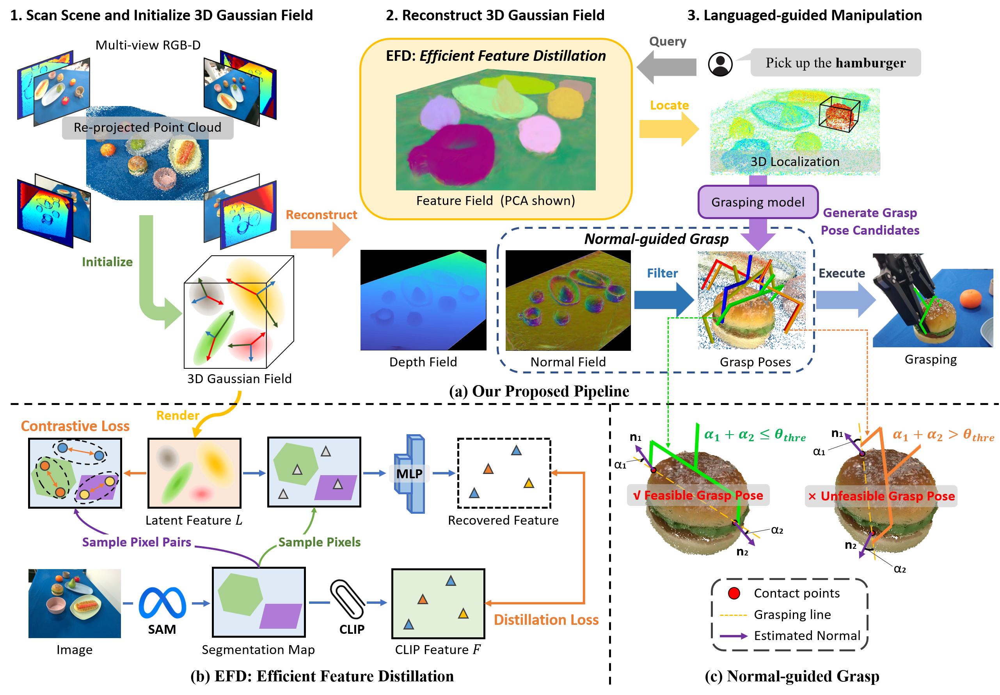

# GaussianGrasper: 3D Language Gaussian Splatting for Open-vocabulary Robotic Grasping

This repository is the pytorch implementation of our paper, **GaussianGrasper**.

**GaussianGrasper: 3D Language Gaussian Splatting for Open-vocabulary Robotic Grasping**
<div align="left">
    <a href="https://arxiv.org/abs/2403.09637" target="_blank">
    </a>
    <a href="https://mrsecant.github.io/GaussianGrasper/" target="_blank">
    </a>
    <a href="https://drive.google.com/file/d/1Zsl0yCXezqwLrAYzOb-u33q8gdjvRfAC/view" target="_blank">
    </a>
</div>

<a href="https://scholar.google.com/citations?user=Wn2Aic0AAAAJ&hl=en&authuser=1"><strong>Yuhang Zheng</strong></a>
·
<strong>Xiangyu Chen</strong>
·
<strong>Yupeng Zheng</strong>
·
<strong>Songen Gu</strong>
·
<a href="https://runyiyang.github.io/"><strong>Runyi Yang</strong></a>
·
<strong>Bu Jin</strong>
·
<strong>Pengfei Li</strong>
·
<strong>Chengliang Zhong</strong>
·
<strong>Zengmao Wang</strong>
·
<strong>Lina Liu</strong>
·
<strong>Chao Yang</strong>
·
<strong>Dawei Wang</strong>
·
<strong>Zhen Chen</strong>
·
<a href="https://www.xxlong.site/"><strong>Xiaoxiao Long</strong></a>📧
·
<strong>Meiqing Wang</strong>📧
<br>Preprint, 2024  (📧 indicates corresponding authors)<br>
      
_________________ 

## Overall

The pipeline of our proposed method. (a) is our proposed pipeline where we scan multi-view RGBD images for initialization and reconstruct 3D Gaussian field via feature distillation and geometry reconstruction. Subsequently, given a language instruction, we locate the target object via open-vocabulary querying. Grasp pose candidates for grasping the target object are then generated by a pre-trained grasping model. Finally, a normal-guided module that uses surface normal to filter out unfeasible candidates is proposed to select the best grasp pose. (b) elaborates on EFD where we leverage contrastive learning to constrain rendered latent feature L and only sample a few pixels to recover features to the CLIP space via an MLP. Then, the recovered features are used to calculate distillation loss with the CLIP features. (c) shows the normal-guided grasp that utilizes Force-closure theory to filter out unfeasible grasp poses. 
<div align=center>  </div>

## Note
This reposity will be updated soon, including:
- [x] **Initialization**.
- [x] Uploading the **Scanned Data**.
- [x] Uploading the **Code for processing**.
- [x] Uploading the **Code for reconstructing feature fields**.
- [ ] Uploading the **Code for grasping**.


## Installation

### Prerequisites

You must have an NVIDIA video card with CUDA installed on the system. This library has been tested with version 11.7 of CUDA. You can find more information about installing CUDA [here](https://docs.nvidia.com/cuda/cuda-quick-start-guide/index.html)

### Create environment

GaussianGrasper requires `python >= 3.8`. We recommend using conda to manage dependencies. Make sure to install [Conda](https://docs.conda.io/miniconda.html) before proceeding.

```bash
conda create --name gsgrasper -y python=3.8
conda activate gsgrasper
```

### Installing PyTorch and ting-cuda-nn

Install PyTorch with CUDA (this repo has been tested with CUDA 11.7) and [tiny-cuda-nn](https://github.com/NVlabs/tiny-cuda-nn).
`cuda-toolkit` is required for building `tiny-cuda-nn`.

```bash
pip install torch==2.0.1+cu117 torchvision==0.15.2+cu117 --extra-index-url https://download.pytorch.org/whl/cu117

conda install -c "nvidia/label/cuda-11.7.1" cuda-toolkit
pip install ninja git+https://github.com/NVlabs/tiny-cuda-nn/#subdirectory=bindings/torch
```

### Installing nerfstudio

Easy option:

```bash
pip install nerfstudio
```

**OR** if you want the latest and greatest:

```bash
git clone https://github.com/nerfstudio-project/nerfstudio.git
cd nerfstudio
pip install --upgrade pip setuptools
pip install -e .
```

### Other dependencies.

```bash
pip install -r requirements.txt
```

## Data preparation and prepariprocessing
```bash
python ./scripts/generate_data.py
```


## Reconstruction 

We provide example scripts to train our model.
```bash
sh train.sh
```

## Rendering

We provide example scripts to render depth, normal and feature maps.

```bash
sh render.sh
```

## Scene updating

We provide example scripts to update the scene.

```bash
sh update.sh
```

## Qualititive results

### Scene reconstruction:
<p align="center">&nbsp &nbsp </p>

### Language-guided grasping:
<p align="center">&nbsp &nbsp </p>

## Citation

If you find our work useful in your research, please consider citing:

```bibtex
@article{zheng2024gaussiangrasper,
      title={GaussianGrasper: 3D Language Gaussian Splatting for Open-vocabulary Robotic Grasping},
      author={Zheng, Yuhang and Chen, Xiangyu and Zheng, Yupeng and Gu, Songen and Yang, Runyi and Jin, Bu and Li, Pengfei and Zhong, Chengliang and Wang, Zengmao and Liu, Lina and others},
      journal={arXiv preprint arXiv:2403.09637},
      year={2024}
}
```


## Acknowledgments
Our code is built on top of open-source GitHub repositories.  We thank all the authors who made their code public, which tremendously accelerates our project progress. If you find these works helpful, please consider citing them as well.

[nerfstudio-project/nerfstudio](https://github.com/nerfstudio-project/nerfstudio)

[graspnet/anygrasp_sdk](https://github.com/graspnet/anygrasp_sdk)
